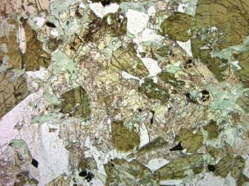
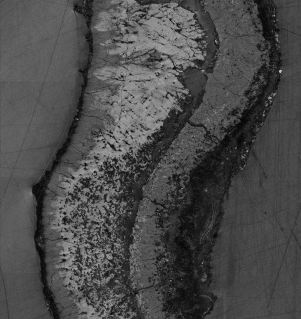

# Welcome to AGU Hack-a-athon with Zeiss!
Your Jupyter Notebook is fully loaded with all the packages you might need for the session, 
your environment is packed with popular tools used in data science and application development, 
from image processing and machine learning packages like `scikit-image` or `Tensorflow` to data analytics 
and visualization frameworks such as `pandas` and `matplotlib`.


```python
# Run this cell for the complete list of packages.
!pip freeze
```

Live questions, team assignments and other shenanigans will be posted here https://goo.gl/kz8qS7, this event is all about community, post questions and share answers on the hackpad either the ZEISS team or other hackers might be able to help.

## Navigating notebook resources
Your notebook comes with several resources that will help you get started, located under `~/AGU17` you 
will find reference information on how to read and explore datasets, look for patterns and visualize 
results:

### Examples
| Location | ~/AGU17 |  	|
|---	|---	|
| | ~/AGU17/00-welcome.ipynb | *This notebook* |
| | ~/AGU17/01-explore.ipynb | *Reading and exploring datasets with `scikit-image` and `pandas`* |
| | ~/AGU17/02-ml_simple.ipynb | *KMeans clustering using `scikit-learn`* |
| | ~/AGU17/03-ml_tf.ipynb | *Feature extraction using `keras` with `Tensorflow` backend* |

### Datasets

##### Challenge No. 1
Mineral classification on polarized light microscopy data (Segmentation and Classification)
    - Sample type: Scottish lamprophyres (2 datasets, 7 images, TIFF format, 2D images) using Primotech



| Location | ~/datasets |  Description | Microscope | File size |
|---	|---	|---	|---	|
| | ~/datasets/Hydrothermal_Vent_Data | *Scottish lamprophyres* | ZEISS Primotech | 758MBi |

```python
# Files for dataset Hydrothermal_Vent_Data
!ls -lhR ~/datasets/Hydrothermal_Vent_Data
```

    datasets/Hydrothermal_Vent_Data:
    total 759M
    -rw-r--r-- 1 M6JCORRE 1049089 729M Dec  5 18:29 100nm_backscatter_region.tif
    -rw-r--r-- 1 M6JCORRE 1049089  30M Dec  5 18:34 815p5_coax.tif
    -rw-r--r-- 1 M6JCORRE 1049089  54K Dec  7 10:39 815p5_coax_thumb.jpg
    

##### Challenge No. 2
Registration of multi-modal data (Registration, Segmentation and Classification)
    - Sample type: Black smoker a.k.a. Hydrothermal vent (2 not-spatially-registered datasets, one co-axial light using Axio Imager and the other one using BSE using Sigma 300, TIFF format, 2D images)
    


| Location | ~/datasets |  Description | Microscope | File size |
|---	|---	|---	|---	|
| | ~/datasets/LM_Multipol_Images | *Black smoker* | ZEISS Axio Imager | 527MBi |

```python
# Files for dataset LM_Multipol_Images
!ls -lhR ~/datasets/LM_Multipol_Images
```

    datasets/LM_Multipol_Images:
    total 76K
    drwxr-xr-x 1 M6JCORRE 1049089   0 Dec  7 10:00 03_0
    drwxr-xr-x 1 M6JCORRE 1049089   0 Dec  7 10:01 03_1
    -rw-r--r-- 1 M6JCORRE 1049089 75K Dec  7 10:41 03ppol001_ORG_thumb.jpg
    drwxr-xr-x 1 M6JCORRE 1049089   0 Dec  7 10:03 06_0
    drwxr-xr-x 1 M6JCORRE 1049089   0 Dec  7 10:05 06_1
    
    datasets/LM_Multipol_Images/03_0:
    total 132M
    -rw-r--r-- 1 M6JCORRE 1049089 18M Oct 22 19:10 03ppol001_ORG.tif
    -rw-r--r-- 1 M6JCORRE 1049089 17M Oct 22 19:11 03xpol00_ORG.tif
    -rw-r--r-- 1 M6JCORRE 1049089 17M Oct 23 09:12 03xpol15_ORG.tif
    -rw-r--r-- 1 M6JCORRE 1049089 17M Oct 23 09:12 03xpol30_ORG.tif
    -rw-r--r-- 1 M6JCORRE 1049089 17M Oct 23 09:12 03xpol45_ORG.tif
    -rw-r--r-- 1 M6JCORRE 1049089 17M Oct 23 09:13 03xpol60_ORG.tif
    -rw-r--r-- 1 M6JCORRE 1049089 17M Oct 23 09:13 03xpol75_ORG.tif
    -rw-r--r-- 1 M6JCORRE 1049089 16M Oct 23 09:13 03xpol90_ORG.tif
    
    datasets/LM_Multipol_Images/03_1:
    total 130M
    -rw-r--r-- 1 M6JCORRE 1049089 18M Oct 23 10:49 031ppol00_ORG.tif
    -rw-r--r-- 1 M6JCORRE 1049089 16M Oct 23 10:49 031xpol00_ORG.tif
    -rw-r--r-- 1 M6JCORRE 1049089 16M Oct 23 10:49 031xpol15_ORG.tif
    -rw-r--r-- 1 M6JCORRE 1049089 17M Oct 23 10:50 031xpol30_ORG.tif
    -rw-r--r-- 1 M6JCORRE 1049089 17M Oct 23 10:50 031xpol45_ORG.tif
    -rw-r--r-- 1 M6JCORRE 1049089 17M Oct 23 10:50 031xpol60_ORG.tif
    -rw-r--r-- 1 M6JCORRE 1049089 17M Oct 23 10:51 031xpol75_ORG.tif
    -rw-r--r-- 1 M6JCORRE 1049089 17M Oct 23 10:51 031xpol90_ORG.tif
    
    datasets/LM_Multipol_Images/06_0:
    total 136M
    -rw-r--r-- 1 M6JCORRE 1049089 16M Oct 23 15:38 06ppol00_ORG.tif
    -rw-r--r-- 1 M6JCORRE 1049089 18M Oct 23 15:39 06xpol00_ORG.tif
    -rw-r--r-- 1 M6JCORRE 1049089 17M Oct 23 15:39 06xpol15_ORG.tif
    -rw-r--r-- 1 M6JCORRE 1049089 17M Oct 23 15:39 06xpol30_ORG.tif
    -rw-r--r-- 1 M6JCORRE 1049089 18M Oct 23 15:40 06xpol45_ORG.tif
    -rw-r--r-- 1 M6JCORRE 1049089 18M Oct 23 15:40 06xpol60_ORG.tif
    -rw-r--r-- 1 M6JCORRE 1049089 18M Oct 23 15:41 06xpol75_ORG.tif
    -rw-r--r-- 1 M6JCORRE 1049089 18M Oct 23 15:41 06xpol90_ORG.tif
    
    datasets/LM_Multipol_Images/06_1:
    total 131M
    -rw-r--r-- 1 M6JCORRE 1049089 14M Oct 23 18:28 062ppol00_ORG.tif
    -rw-r--r-- 1 M6JCORRE 1049089 17M Oct 23 18:29 062xpol00_ORG.tif
    -rw-r--r-- 1 M6JCORRE 1049089 17M Oct 23 18:29 062xpol15_ORG.tif
    -rw-r--r-- 1 M6JCORRE 1049089 17M Oct 23 18:29 062xpol30_ORG.tif
    -rw-r--r-- 1 M6JCORRE 1049089 17M Oct 23 18:30 062xpol45_ORG.tif
    -rw-r--r-- 1 M6JCORRE 1049089 17M Oct 23 18:30 062xpol60_ORG.tif
    -rw-r--r-- 1 M6JCORRE 1049089 17M Oct 23 18:30 062xpol75_ORG.tif
    -rw-r--r-- 1 M6JCORRE 1049089 17M Oct 23 18:30 062xpol90_ORG.tif
    

## Commiting your code
The repo *AGU17* on your `$HOME` directory has been cloned from https://github.com/ZEISSMicroscopyRMI/AGU17.git, we encorage you to branch it for your own development, make a PR and share your work on the main repo.

## Working offline
If you prefer to work offline, both notebooks and datasets are also available via:
 - Notebooks: `git clone https://github.com/ZEISSMicroscopyRMI/AGU17.git`
 - Datasets: https://goo.gl/Ui5pAA

# Additional packages
The terminal module on Jupyter is fully enabled, you can installed additional packages as needed.

# Zeiss RMI team@AGU
- Matthew Andrew, *GEO-ninja* [@DrMatthewAndrew](https://twitter.com/DrMatthewAndrew)
- Brenda Ropoulos, *Mom* [@bropo](https://twitter.com/bropo)
- Shaun Graham, *GEO-ninja* [@Shaung57](https://twitter.com/Shaung57)
- Joaquin Correa, *Brain scramblerer* [@byjoaquincorrea](https://twitter.com/byjoaquincorrea)


```python
welcome_str_ = """  _  _                       _            _   _              __                 ____    _       _ \n \
 | || |__ _ _ __ _ __ _  _  | |_  __ _ __| |_(_)_ _  __ _   / _|_ _ ___ _ __   |_  /___(_)_____| |\n \
 | __ / _` | '_ \ '_ \ || | | ' \/ _` / _| / / | ' \/ _` | |  _| '_/ _ \ '  \   / // -_) (_-<_-<_|\n \
 |_||_\__,_| .__/ .__/\_, | |_||_\__,_\__|_\_\_|_||_\__, | |_| |_| \___/_|_|_| /___\___|_/__/__(_)\n \
           |_|  |_|   |__/                          |___/                                         \n"""
print(welcome_str_)
```

      _  _                       _            _   _              __                 ____    _       _ 
      | || |__ _ _ __ _ __ _  _  | |_  __ _ __| |_(_)_ _  __ _   / _|_ _ ___ _ __   |_  /___(_)_____| |
      | __ / _` | '_ \ '_ \ || | | ' \/ _` / _| / / | ' \/ _` | |  _| '_/ _ \ '  \   / // -_) (_-<_-<_|
      |_||_\__,_| .__/ .__/\_, | |_||_\__,_\__|_\_\_|_||_\__, | |_| |_| \___/_|_|_| /___\___|_/__/__(_)
                |_|  |_|   |__/                          |___/                                         
    
    
